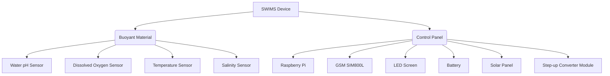

# S.W.I.M.S

SWIMS (Smart Water Information Management System): The roadmap outlines key steps in developing SWIMS, focusing on sensor integration, data management, control implementation, testing, and documentation.

### pH Module
- [ ] Interface DFRobot pH sensor with UART communication protocol
- [ ] Develop pH reading function with temperature compensation
- [ ] Compare pH readings against acceptable thresholds
- [ ] Log pH data in defined JSON format and store in SQLite database

## Dissolved Oxygen Module
- [ ] Integrate dissolved oxygen sensor via I2C bus
- [ ] Implement dissolved oxygen concentration calculation and calibration
- [ ] Apply data filtering techniques (moving average, exponential smoothing)
- [ ] Log dissolved oxygen data in JSON format and store in SQLite database

## Temperature Monitoring
- [ ] Interface temperature sensor using analog-to-digital converter (ADC)
- [ ] Write function to convert analog values to temperature in Celsius
- [ ] Analyze temperature data trends and fluctuations
- [ ] Log temperature data in JSON format and store in SQLite database

## Salinity Module
- [ ] Connect salinity sensor using SPI communication protocol
- [ ] Develop function to retrieve and adjust salinity for conductivity and temperature
- [ ] Monitor salinity levels and deviations from optimal range
- [ ] Log salinity data in JSON format and store in SQLite database

## Servo Control
- [ ] Wire 4 MG90 servo motors to Raspberry Pi GPIO pins
- [ ] Import RPi.GPIO Python library for servo control
- [ ] Implement script to operate servos based on sensor readings

## Logging
- [ ] Integrate sensor reading functions into main data logging script
- [ ] Define JSON data structure for logging sensor data with timestamps
- [ ] Implement SQLite database for local storage of sensor readings

## Documentation
- [ ] Document code with inline comments explaining functions
- [ ] Create user guide covering setup, usage, troubleshooting
